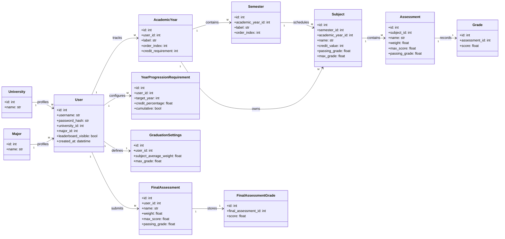
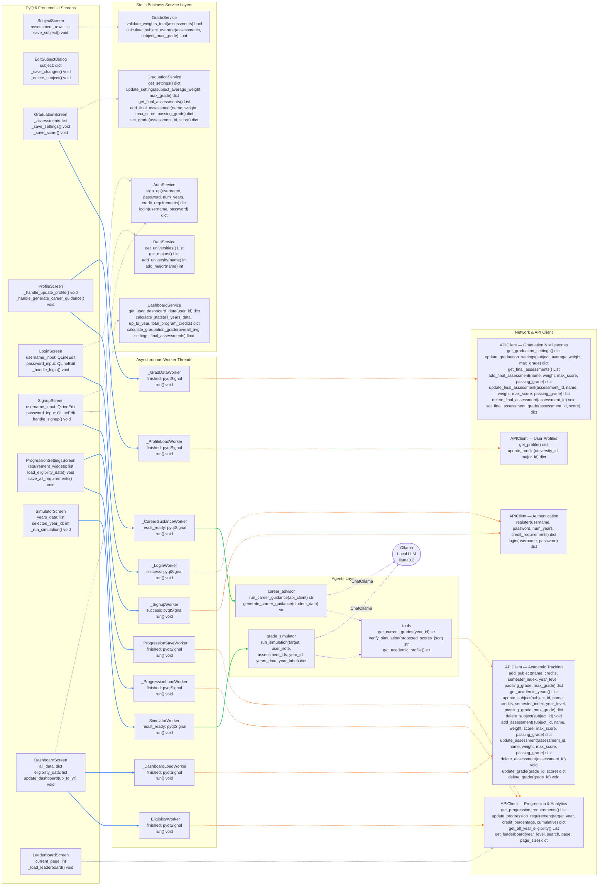

# University-Grade-Calculator

A comprehensive full-stack application designed to help university students track, manage, and optimize their academic performance. The platform dynamically calculates grades and credit requirements while providing real-time visual progress bars to ensure students meet minimum benchmarks for yearly academic progression. Additionally, it integrates advanced AI-driven features, including an intelligent grade simulator and a personalized career advisor agent, to help students strategically plan their academic and professional journeys.

---

## 📐 Architecture & System Design

This project follows a clean, layered architecture separating the database models, business logic (services), API endpoints (routers), and frontend user interface.

### 1. Use Case Diagram
*It shows how the student interacts with each application tab and how the two AI agents (grade simulator and career advisor) communicate with the local Ollama LLM service and the FastAPI backend to fetch and verify data through their tool calls.*

```mermaid
flowchart TD
    student(["Student User"])

    subgraph system["UniGrade System — PyQt6 Client"]
        subgraph auth["Auth Screen Paths · LoginScreen / SignupScreen"]
            uc1(["Authenticate Account
Login / Signup"])
        end

        subgraph dash["DashboardScreen View"]
            uc2(["View Progress Bars
Weighted Average · Simple Grades · Earned Credits"])
        end

        subgraph prog["ProgressionSettingsScreen View"]
            uc3(["Configure Progression Rules
Set Credit % Thresholds & Toggle Cumulative Mode"])
            uc4(["Verify Year Advancement Eligibility
View Real-Time Pass/Fail Metrics"])
        end

        subgraph subj["Subject Screen & Dialog · SubjectScreen / EditSubjectDialog"]
            uc5(["Save Subject Data
save_subject() / _save_changes()"])
        end

        subgraph grad["GraduationScreen View"]
            uc6(["Save Milestone Scores
_save_score() / _save_settings()"])
        end

        subgraph lb["LeaderboardScreen View"]
            uc7(["View University-level Leaderboard
Filter Class Standings & Set Visibility"])
        end

        subgraph ai["Interactive AI Core · SimulatorScreen / ProfileScreen"]
            uc8(["Simulate Score Requirements
SimulatorScreen via grade_simulator.py"])
            uc9(["Generate Career Path Guidance
ProfileScreen via career_advisor.py"])
        end
    end

    ollama(["Ollama
Local LLM"])

    student --> uc1
    student --> uc2
    student --> uc3
    student --> uc4
    student --> uc5
    student --> uc6
    student --> uc7
    student --> uc8
    student --> uc9

    uc8 -->|"Invokes ReAct agent loop
tools call FastAPI + Ollama"| ollama
    uc9 -->|"Invokes ReAct agent loop
tools call FastAPI + Ollama"| ollama
```




### 2. Class Diagram
It illustrates the database schema for an academic performance tracking system, mapping how user profiles link to chronological course timelines, progression rules, and final graduation requirements.




### 3. Architectural Class Diagram
It illustrates how the PyQt6 frontend screens trigger asynchronous background worker threads, route workflows through client-side business logic services, and communicate with the central API network gateway to ensure responsive data processing and strict layer isolation. The AI agent layer sits inside those same background workers: each agent runs a LangGraph ReAct loop that calls its tools (`get_current_grades`, `verify_simulation`, `get_academic_profile`) to fetch and verify data before producing its final answer.



*Arrow key — blue solid: spawns worker · gray dashed: local service call · green solid: delegates to agent · purple dashed: tool / LLM call · orange dashed: HTTP API call*


---

## 🛠️ Getting Started

### Prerequisites

| Requirement | Version | Purpose |
|---|---|---|
| Python | 3.13+ | Runs both the desktop client and the API server |
| PostgreSQL | 15+ | Stores all academic data |
| [Ollama](https://ollama.com) | latest | Local LLM runtime for AI features |

> **AI features only** — Ollama is optional. The grade simulator and career advisor fall back to rule-based logic when Ollama is not available.

---

### Setup

Docker Compose starts PostgreSQL and the FastAPI server automatically, including seeding the database. You only need to start the desktop client manually.

```bash
# 1. Clone and enter the repository
git clone https://github.com/matei53/University-Grade-Calculator.git
cd University-Grade-Calculator

# 2. Configure environment variables
cp .env.example .env
# Edit .env — set POSTGRES_PASSWORD and SECRET_KEY at minimum

# 3. Start the database and API server (seeds automatically)
docker-compose up -d

# 4. Install Python client dependencies
pip install -r requirements.txt

# 5. Start the desktop application
python main.py
```

---

### Enabling AI Features (Ollama)

```bash
# Install Ollama from https://ollama.com, then pull the model used by the agents:
ollama pull llama3.2

# Ollama starts automatically as a background service after installation.
# The grade simulator and career advisor will use it once it is running.
```

---

### Running the Tests

```bash
# Fast tests (no Ollama required) — run by CI
pytest tests/ -m "not slow" -v

# Slow integration tests (require a running Ollama instance with llama3.2)
pytest tests/ -m slow -v

# Server-side tests
pytest server/tests/ -v
```

---

## 🚀 How to Use the Application

Once you open UniGrade, you can easily navigate through your academic journey using the menu buttons at the top of the screen:

### 📊 Main Dashboard & Progress Tracking
* 📊 **Monitor Overall Progress:** View your overall weighted average, total credits, and overall completion percentage on a live progress bar. **Crucial Rule:** Credits are only unlocked and added to your progress bar *after* you get a passing grade in a subject!
* 📊 **Monitor Annual Progress**: Expand the Year dropdown sections to see deep analytics for that specific year including passed credits, simple average, and course lists. 
* 📊 **Track Year Progression:** Check your eligibility status at a glance. The dashboard displays a clear `✓ ELIGIBLE` or `✗ NOT ELIGIBLE` badge so you know if you have passed enough classes to advance to the next university year.

### ⚙️ Academic Configuration & Data Management
* ⚙️ **Manage Subjects:** Click the **Add Subject** button to add your courses, input their credit values, and set custom passing and maximum grade scales. Here, you can add assessment components (for example: exam, homework, project, lab tests) and assign percentage weights to each component (totaling 100%). After you input your grade for each assessment component, the system will automatically calculate your final grade for the subject. 
* ⚙️ **Log & Edit Course Data:** Click the **Edit** button next to any subject. You can modify any previously entered subject details or entirely delete the subject. 
* ⚙️ **Set Progression Requirements:** Click the **Progression** button to customize your advancement rules. Here, you can change the minimum credit percentage required to pass each year and toggle between single-year metrics or cumulative (rolling multi-year) calculations.

### 📊 Analytics & Community Standings
* 📊 **Leaderboard Tab:** Open the **Leaderboard** to view class standings and see how your academic average stacks up against your peers. You can use the search bar to find friends, filter standings by university year, or toggle your own profile visibility on or off.

### ⚙️ Smart AI Assistants
* ⚙️ **Grade Simulator Tab:** Click the **Grade Simulator** button to run predictive "what-if" scenarios. Simply type in your target GPA, select which upcoming or retakeable assignments you want to calculate, and the AI agent will tell you the exact scores you need to hit your goal.
* ⚙️ **Career Advisor Tab:** Head to your **Profile** and click **Generate Career Guidance**. The built-in AI counselor will analyze your passed courses, strengths, and grades to build a personalized roadmap for your future internships and career choices.

---
## 🤖 AI Usage Report

This section outlines how Artificial Intelligence tools were leveraged throughout the Software Development Life Cycle (SDLC) to accelerate the design, implementation, and debugging of UniGrade.

### ⚙️ 1. AI Tool Roles
* **GitHub Copilot:** Used as an intelligent inline assistant for fast code autocompletion and writing quick PyQt6 frontend and FastAPI backend boilerplate.
* **Gemini:** Used as a high-level architectural consultant to design prompt engineering strategies for our AI agents, map out database schemas, and diagnose pipeline bugs.
* **Claude Code:** Used as an autonomous coding agent throughout the entire development cycle — implementing and debugging features across the full stack, maintaining test coverage, enforcing code quality, and keeping documentation current.

### 📊 2. Frontend Development (PyQt6)
* **What the AI did:** Copilot quickly generated native desktop layout components, turning basic text forms into clean, organized `QFormLayout` and `QGridLayout` code blocks.
* **Where it failed:** The AI lacked spatial reasoning. It accidentally placed the **Delete Account** button directly over a panel border line. We had to manually rewrite the layout sequence, fix widget nesting, and inject `QSpacerItem` barriers to correct the visual layout.

### ⚙️ 3. Backend, CI/CD, and Debugging
* **What the AI did:** Cline automated our CRUD server endpoints, generating safe database query loops for creating, updating, and deleting academic data.
* **CI/CD Pipeline Fix:** When GitHub Actions automated tests crashed with a `ModuleNotFoundError: No module named 'PyQt6'`, Gemini diagnosed that the remote environment runner was trying to load frontend UI requirements during isolated backend tests. We then used Cline to swiftly rewrite file imports into absolute `server.` paths, repairing the pipeline.
* **Linter Compliance:** AI assisted in maintaining strict code hygiene, scanning for Flake8 errors and instantly fixing formatting oversights (such as replacing undefined catch variables with standard `{e}` exceptions).

### 📊 4. Core Feature Integration
* **Data Mapping:** We used AI to design clean mapping structures that convert complex PostgreSQL relational tables into plain Python dictionaries. This sanitized data is what gets passed safely into LangChain and our local Ollama framework to feed our background-threaded AI agents.

### ⚙️ 5. Claude Code — Autonomous Development Assistant

* **Broad usage:** Applied across the full project lifecycle — scaffolding new features, diagnosing and fixing bugs anywhere in the codebase, writing and updating tests, resolving linter violations (Flake8, type errors), and keeping documentation in sync with the code.
* **Agent implementation:** Converted the grade simulator and career advisor from simple LLM prompt-and-parse pipelines into genuine **LangGraph ReAct agents**. Each agent now runs a reason → tool-call → observe loop, calling dedicated tools (`get_current_grades`, `verify_simulation`, `get_academic_profile`) before producing its final answer.
* **Prompt engineering & robustness:** Identified and fixed a denominator exploit where the LLM would intentionally leave subjects ungraded to inflate the weighted average. Added a `MANDATORY IDs` checklist to the data prompt, a targeted-retry mechanism for missing assessment IDs, and a Python-level `_fill_mandatory` safeguard as a final safety net. Also added `_normalize` post-processing to handle numeric values the LLM occasionally returns as strings.
* **Debugging:** Diagnosed that `llama3.2` does not emit structured tool-call tokens without initial context, causing the career advisor to display raw JSON instead of guidance. Fixed by pre-fetching the student profile in Python and injecting it directly into the conversation.
* **Testing:** Rewrote every test for both agent features from zero — 74 unit tests (mocked) and 11 slow integration tests that invoke the real `llama3.2` model end-to-end.

### ⚙️ 6. Key Limitations & Failures
* **Hallucinations:** AI assistants occasionally lost track of our codebase scope, inventing variables that did not exist. This led to multiple `NameError` bugs (such as referencing an undefined `raw_year` variable during database writes) which required manual code auditing.
* **Pathing Mistakes:** The AI frequently mixed up package roots and directory structures, writing broken internal imports that had to be manually re-mapped.
* **Small model reliability:** `llama3.2` (3B parameters) struggles to follow multi-constraint instructions reliably. Prompt-level enforcement alone was not sufficient; Python-level guardrails were necessary to guarantee complete output coverage.

### 📊 7. Conclusion
Combining GitHub Copilot (for quick boilerplate), Gemini (for architectural problem-solving), and Claude Code (as an autonomous assistant throughout the project) reduced our overall engineering and debugging timeline by **70-80%**. While AI serves as a powerful development accelerator, rigorous human oversight is mandatory to correct architectural scope, fix file pathing, resolve visual UI bugs, and compensate for small-model instruction-following failures.
